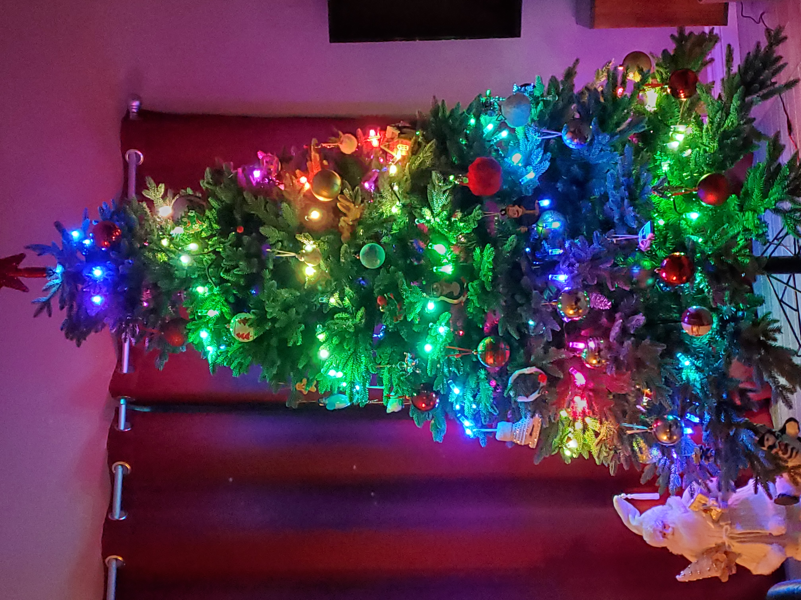
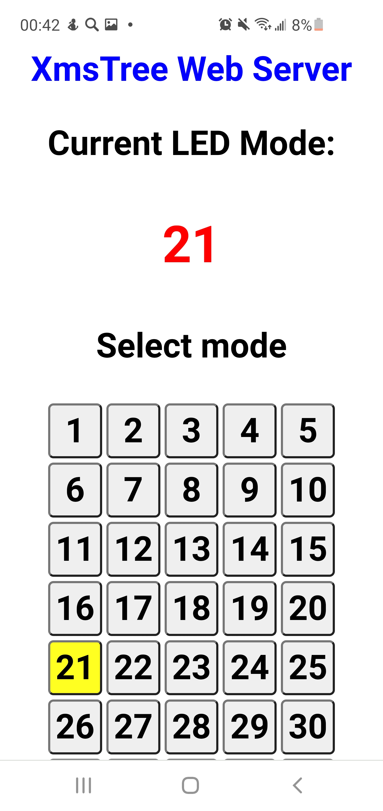

# ChristmasLights
 Forked from AlexGyver/ChristmasLights
 Ported to ESP32, added Web Controls
 
 <table><tr><td>
 </td><td>
 </td></tr></table>
 
 firmware/notamesh4_gyver_v1.1.ino
 Adjust IR_MAX_LED, CHIPSET, POWER_V, POWER_I
 LED_DT should match the Arduino IO pin for your board
 
 firmware/1main.ino
 set your SSID and password
 KOL_LED should match IR_MAX_LED (above)
 
Compile, flash, restart. Open port monitor, check the IP address.
Open this IP in your browser, use buttons to select and fix mode (upon startup the program will loop through all modes)
